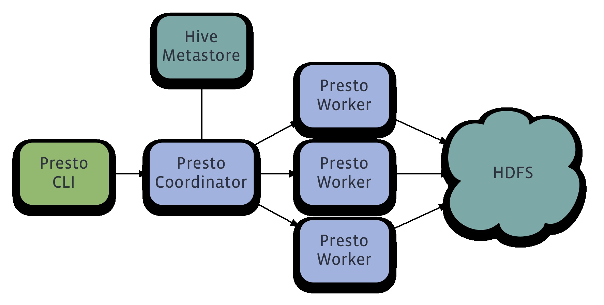

# Promethium Data Connector Utility



## Overview

Promethium Data Connector Utility is a comprehensive tool designed to simplify data integration and performance optimization for Trino/Presto databases. The utility streamlines the process of connecting to various data sources, optimizing query execution, and providing insightful performance metrics. It ensures that your data-driven workflows are efficient and scalable, catering to the needs of today’s dynamic data environments.

## Features

- **Multi-Source Data Integration:** Seamlessly connect to multiple data sources using our extended Trino connectors.
- **Query Optimization:** Automatically identify bottlenecks and optimize query execution plans for improved performance.
- **Performance Metrics:** Run and analyze software performance metrics to maintain high efficiency.
- **Global Collaboration:** Fully compatible with Agile development environments and supports collaboration across multiple time zones.
- **Automation Support:** Write and run automated tests as part of the ongoing infrastructure development.
- **Scalability:** Guide DevOps and Data Engineering teams to scale Trino clusters to handle petabytes of data.

## Getting Started

### Prerequisites

Before you begin, ensure you have the following installed on your system:

- **Java Development Kit (JDK) 11 or higher**
- **Apache Maven 3.6.3 or higher**
- **Docker** (for running containers)
- **Kubectl** (for interacting with Kubernetes clusters)

### Installation

1. Clone the repository:

   ```bash
   git clone https://github.com/your-username/promethium-data-connector.git
   cd promethium-data-connector
   ```

2. Build the project using Maven:

   ```bash
   mvn clean install
   ```

3. Set up the required Docker containers:

   ```bash
   docker-compose up -d
   ```

4. Deploy the application to a Kubernetes cluster:

   ```bash
   kubectl apply -f k8s/deployment.yaml
   ```

## Usage

### Configuration

The application requires a configuration file (`config.yml`) to define the data sources and other parameters. An example configuration file is provided in the repository:

```yaml
trino:
  host: your-trino-host
  port: 8080
  user: your-username
  catalog: your-catalog
  schema: your-schema

sources:
  - name: source1
    type: mysql
    host: mysql-host
    port: 3306
    user: mysql-user
    password: mysql-password
    database: mysql-database

  - name: source2
    type: postgres
    host: postgres-host
    port: 5432
    user: postgres-user
    password: postgres-password
    database: postgres-database
```

### Running the Application

Start the application using the following command:

```bash
java -jar target/promethium-data-connector.jar --config config.yml
```

### Optimizing Queries

The utility provides a built-in optimizer. To use it, follow these steps:

1. Submit your SQL query to the optimizer endpoint:

   ```bash
   curl -X POST -d @query.sql http://localhost:8080/optimize
   ```

2. Receive the optimized query and execution plan:

   ```json
   {
     "optimizedQuery": "SELECT * FROM optimized_table",
     "executionPlan": { ... }
   }
   ```

### Viewing Performance Metrics

The application exposes performance metrics at the `/metrics` endpoint. Access it via your web browser or a tool like `curl`:

```bash
curl http://localhost:8080/metrics
```

### Running Automated Tests

To ensure that your configurations and connectors work as expected, run the automated test suite:

```bash
mvn test
```

## Contributing

We welcome contributions to improve the Promethium Data Connector Utility. Please fork the repository and submit your pull requests. For major changes, open an issue to discuss what you would like to change.

## License

This project is licensed under the MIT License. See the `LICENSE` file for details.

## Contact

For any questions or issues, please contact [your-email@domain.com](mailto:your-email@domain.com).

---

**Promethium** - Making Data-Driven Decisions Simple and Efficient
